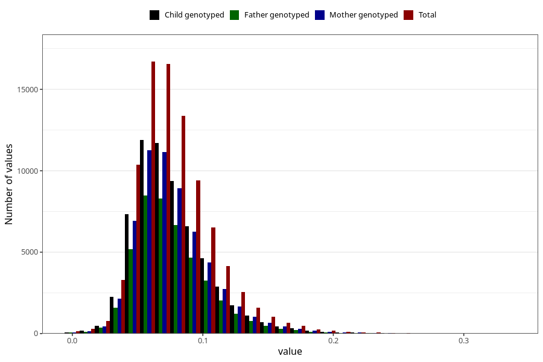

# food_aa_g_day
Variable mapping to questionnaire: q2_fatty_acid_iodine, question f_aa.
- Number of values:

| Value | Total | Child genotyped | Mother genotyped | Father genotyped |
| ----- | ----- | --------------- | ---------------- | ---------------- |
| Missing | 24927 | 14790 | 12674 | 6238 |
| Non-missing | 88696 | 68565 | 59095 | 43980 |
| 25th percentile | 0.0571 | 0.057 | 0.0571 | 0.057 |
| 50th percentile | 0.0721 | 0.0721 | 0.072 | 0.0719 |
| 75th percentile | 0.092 | 0.0919 | 0.0917 | 0.0915 |

