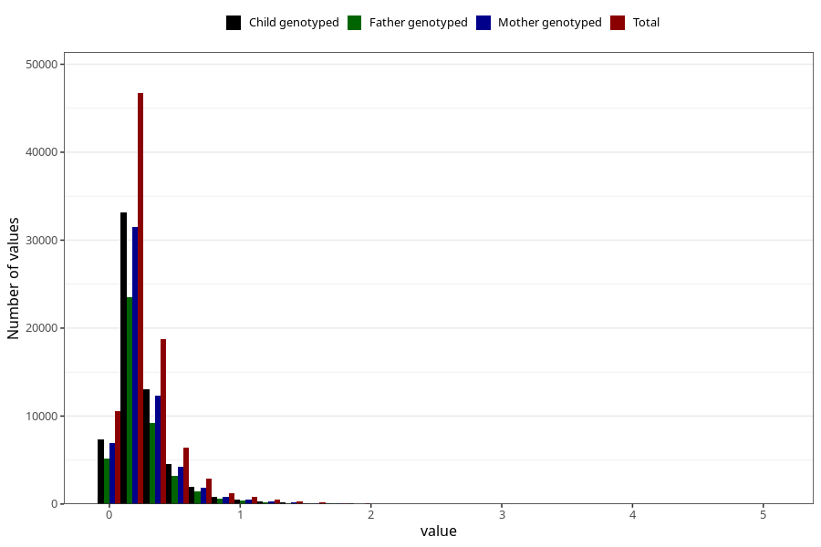

# food_dha_g_day
Variable mapping to questionnaire: q2_fatty_acid_iodine, question f_dha.
- Number of values:

| Value | Total | Child genotyped | Mother genotyped | Father genotyped |
| ----- | ----- | --------------- | ---------------- | ---------------- |
| Missing | 24927 | 13198 | 12674 | 6238 |
| Non-missing | 88696 | 62233 | 59095 | 43980 |
| 25th percentile | 0.1289 | 0.1289 | 0.1287 | 0.129275 |
| 50th percentile | 0.2034 | 0.2018 | 0.2016 | 0.2018 |
| 75th percentile | 0.3208 | 0.3176 | 0.3172 | 0.3152 |

