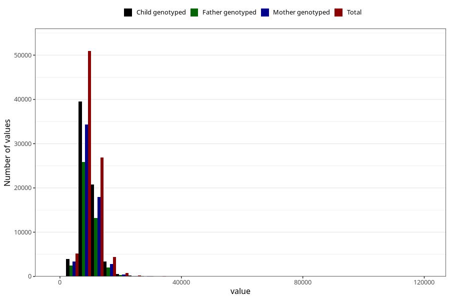

# food_kJ_day
Variable mapping to questionnaire: q2_caffeine_supplements, question f_kJ.
- Number of values:

| Value | Total | Child genotyped | Mother genotyped | Father genotyped |
| ----- | ----- | --------------- | ---------------- | ---------------- |
| Missing | 24927 | 14790 | 12674 | 6238 |
| Non-missing | 88696 | 68565 | 59095 | 43980 |
| 25th percentile | 7890.545 | 7893.56 | 7896.495 | 7867.205 |
| 50th percentile | 9382.87 | 9377.66 | 9366.49 | 9319.05 |
| 75th percentile | 11204.06 | 11172.37 | 11151.935 | 11078.4725 |

