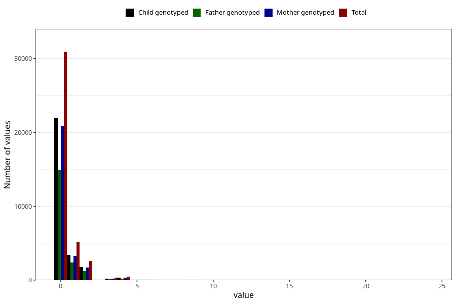

# herbal_tea_before
Variable mapping to questionnaire: q1m, question AA1389.
- Number of values:

| Value | Total | Child genotyped | Mother genotyped | Father genotyped |
| ----- | ----- | --------------- | ---------------- | ---------------- |
| Missing | 73950 | 47600 | 45267 | 31198 |
| Non-missing | 39673 | 27831 | 26502 | 19020 |
| 0 | 30927 | 21933 | 20875 | 14976 |
| 1 | 5119 | 3449 | 3302 | 2404 |
| 2 | 2609 | 1785 | 1691 | 1210 |
| 3 | 310 | 193 | 186 | 126 |
| 4 | 462 | 315 | 304 | 205 |
| 5 | 55 | 32 | 30 | 20 |
| 6 | 92 | 58 | 54 | 42 |
| 7 | 14 | 10 | 9 | 4 |
| 8 | 42 | 25 | 22 | 15 |
| 9 | 4 | 3 | 2 | 2 |
| 10 | 20 | 13 | 12 | 4 |
| 12 | 13 | 11 | 11 | 10 |
| 14 | 1 | 1 | 1 | 1 |
| 15 | 1 | 0 | 0 | 0 |
| 16 | 1 | 1 | 1 | 1 |
| 18 | 1 | 0 | 0 | 0 |
| 20 | 1 | 1 | 1 | 0 |
| 24 | 1 | 1 | 1 | 0 |

