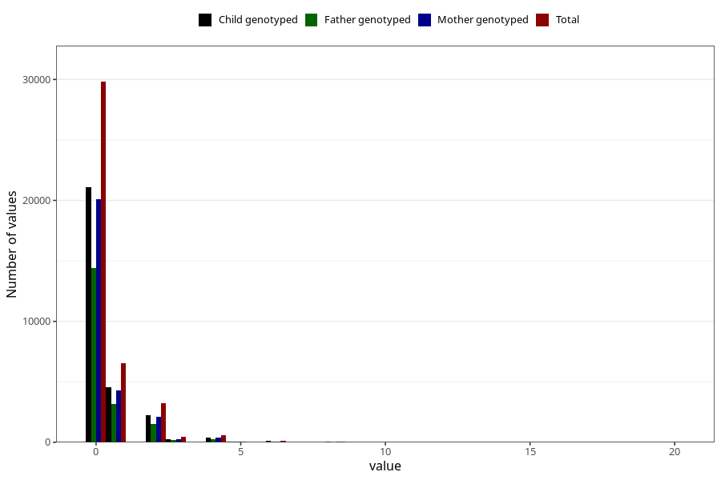

# herbal_tea_during
Variable mapping to questionnaire: q1m, question AA1390.
- Number of values:

| Value | Total | Child genotyped | Mother genotyped | Father genotyped |
| ----- | ----- | --------------- | ---------------- | ---------------- |
| Missing | 72641 | 46666 | 44375 | 30587 |
| Non-missing | 40982 | 28765 | 27394 | 19631 |
| 0 | 29810 | 21090 | 20102 | 14399 |
| 1 | 6562 | 4536 | 4312 | 3145 |
| 2 | 3255 | 2239 | 2136 | 1523 |
| 3 | 439 | 282 | 265 | 171 |
| 4 | 598 | 411 | 391 | 274 |
| 5 | 74 | 48 | 43 | 29 |
| 6 | 148 | 98 | 89 | 54 |
| 7 | 13 | 8 | 8 | 4 |
| 8 | 51 | 33 | 31 | 19 |
| 10 | 15 | 11 | 9 | 6 |
| 11 | 2 | 0 | 0 | 0 |
| 12 | 9 | 7 | 6 | 6 |
| 15 | 1 | 0 | 0 | 0 |
| 16 | 3 | 1 | 1 | 1 |
| 20 | 2 | 1 | 1 | 0 |

