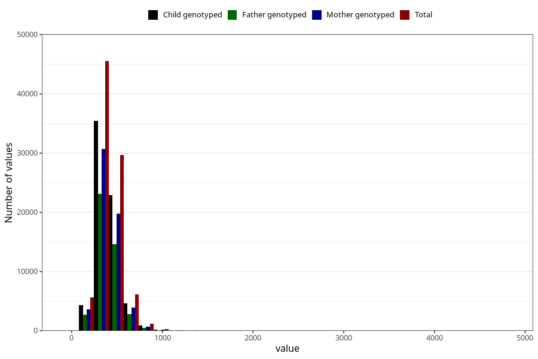

# magnesium
Variable mapping to questionnaire: q2_cwd_calculations, question MAGNESIUM.
- Number of values:

| Value | Total | Child genotyped | Mother genotyped | Father genotyped |
| ----- | ----- | --------------- | ---------------- | ---------------- |
| Missing | 24927 | 14790 | 12674 | 6238 |
| Non-missing | 88696 | 68565 | 59095 | 43980 |
| 25th percentile | 320.9975 | 320.74 | 320.955 | 320.07 |
| 50th percentile | 388.575 | 387.98 | 387.84 | 386.235 |
| 75th percentile | 469.66 | 467.87 | 467.155 | 464.8825 |

