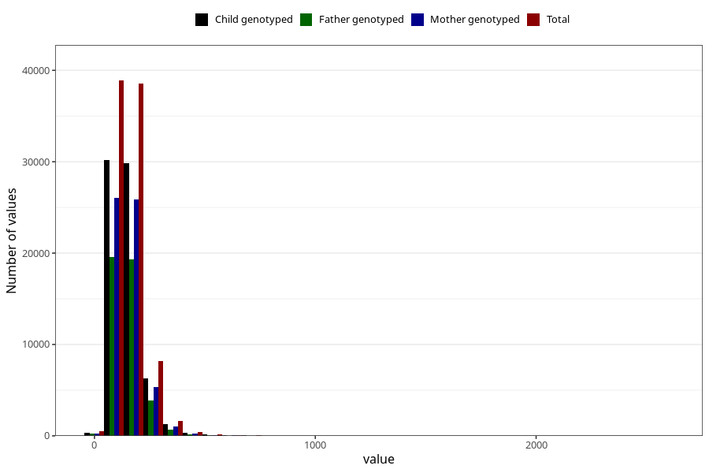

# mono_and_disaccharides
Variable mapping to questionnaire: q2_cwd_calculations, question MONO_DISAKK.
- Number of values:

| Value | Total | Child genotyped | Mother genotyped | Father genotyped |
| ----- | ----- | --------------- | ---------------- | ---------------- |
| Missing | 24927 | 13198 | 12674 | 6238 |
| Non-missing | 88696 | 62233 | 59095 | 43980 |
| 25th percentile | 108.3475 | 108.29 | 108.24 | 107.69 |
| 50th percentile | 140.54 | 140.18 | 140.08 | 139.5 |
| 75th percentile | 181.8325 | 180.81 | 180.72 | 179.55 |

