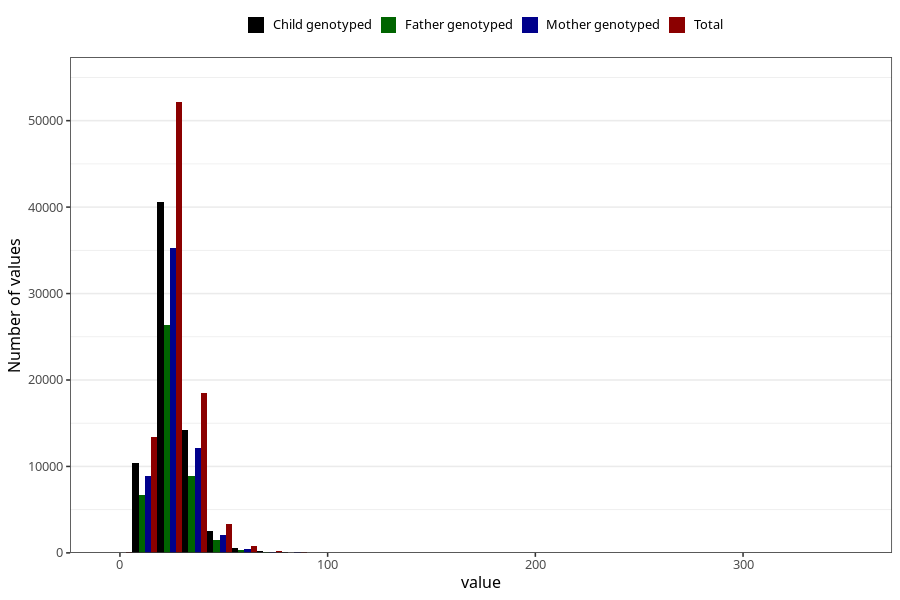

# monounsaturated_fatty_acids
Variable mapping to questionnaire: q2_cwd_calculations, question ENUMETTET.
- Number of values:

| Value | Total | Child genotyped | Mother genotyped | Father genotyped |
| ----- | ----- | --------------- | ---------------- | ---------------- |
| Missing | 24927 | 14790 | 12674 | 6238 |
| Non-missing | 88696 | 68565 | 59095 | 43980 |
| 25th percentile | 20.02 | 19.99 | 20.01 | 19.89 |
| 50th percentile | 24.56 | 24.51 | 24.48 | 24.32 |
| 75th percentile | 30.28 | 30.16 | 30.05 | 29.87 |

