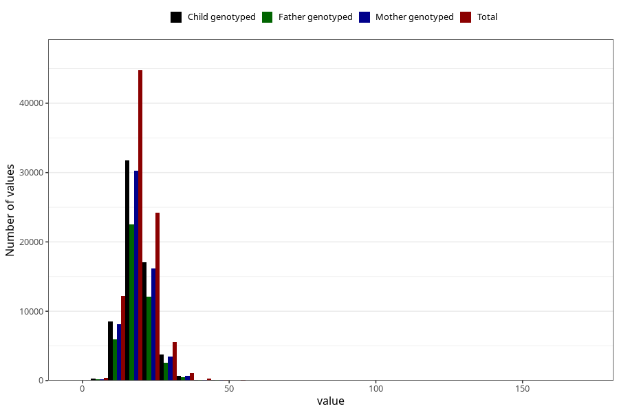

# niacin
Variable mapping to questionnaire: q2_cwd_calculations, question NIACIN.
- Number of values:

| Value | Total | Child genotyped | Mother genotyped | Father genotyped |
| ----- | ----- | --------------- | ---------------- | ---------------- |
| Missing | 24927 | 14790 | 12674 | 6238 |
| Non-missing | 88696 | 68565 | 59095 | 43980 |
| 25th percentile | 16.08 | 16.07 | 16.08 | 16.09 |
| 50th percentile | 18.77 | 18.75 | 18.74 | 18.73 |
| 75th percentile | 21.88 | 21.84 | 21.79 | 21.76 |

