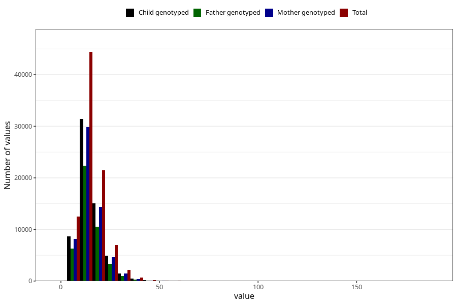

# polyunsaturated_fatty_acids
Variable mapping to questionnaire: q2_cwd_calculations, question FLERUMETTET.
- Number of values:

| Value | Total | Child genotyped | Mother genotyped | Father genotyped |
| ----- | ----- | --------------- | ---------------- | ---------------- |
| Missing | 24927 | 13198 | 12674 | 6238 |
| Non-missing | 88696 | 62233 | 59095 | 43980 |
| 25th percentile | 11 | 11.02 | 11.02 | 10.94 |
| 50th percentile | 13.98 | 13.97 | 13.97 | 13.84 |
| 75th percentile | 18.11 | 18.07 | 18.06 | 17.87 |

