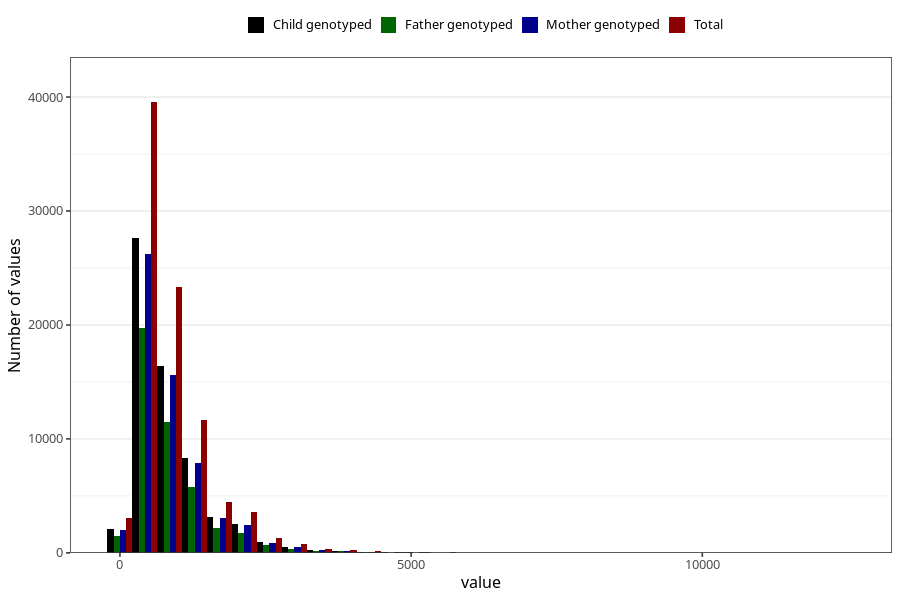

# retinol
Variable mapping to questionnaire: q2_cwd_calculations, question RETINOL.
- Number of values:

| Value | Total | Child genotyped | Mother genotyped | Father genotyped |
| ----- | ----- | --------------- | ---------------- | ---------------- |
| Missing | 24927 | 14790 | 12674 | 6238 |
| Non-missing | 88696 | 68565 | 59095 | 43980 |
| 25th percentile | 425.8975 | 426.24 | 428.995 | 426.53 |
| 50th percentile | 663.765 | 663 | 666.94 | 661.665 |
| 75th percentile | 1082.93 | 1084.89 | 1089.595 | 1080.5325 |

