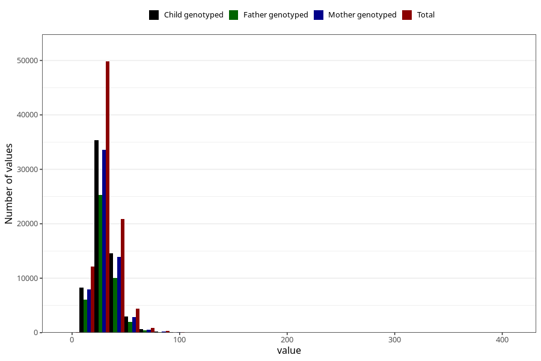

# saturated_fatty_acids
Variable mapping to questionnaire: q2_cwd_calculations, question METTET.
- Number of values:

| Value | Total | Child genotyped | Mother genotyped | Father genotyped |
| ----- | ----- | --------------- | ---------------- | ---------------- |
| Missing | 24927 | 14790 | 12674 | 6238 |
| Non-missing | 88696 | 68565 | 59095 | 43980 |
| 25th percentile | 23.86 | 23.87 | 23.91 | 23.79 |
| 50th percentile | 29.45 | 29.43 | 29.43 | 29.2 |
| 75th percentile | 36.57 | 36.46 | 36.43 | 36.07 |

