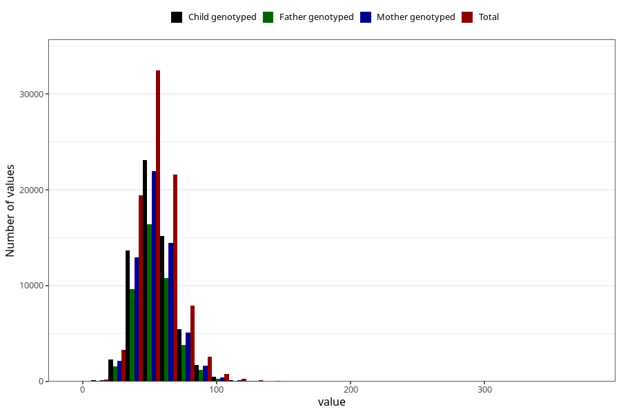

# selenium
Variable mapping to questionnaire: q2_cwd_calculations, question SELEN.
- Number of values:

| Value | Total | Child genotyped | Mother genotyped | Father genotyped |
| ----- | ----- | --------------- | ---------------- | ---------------- |
| Missing | 24927 | 13198 | 12674 | 6238 |
| Non-missing | 88696 | 62233 | 59095 | 43980 |
| 25th percentile | 44.59 | 44.64 | 44.65 | 44.63 |
| 50th percentile | 53.33 | 53.3 | 53.29 | 53.27 |
| 75th percentile | 63.14 | 62.9 | 62.86 | 62.73 |

