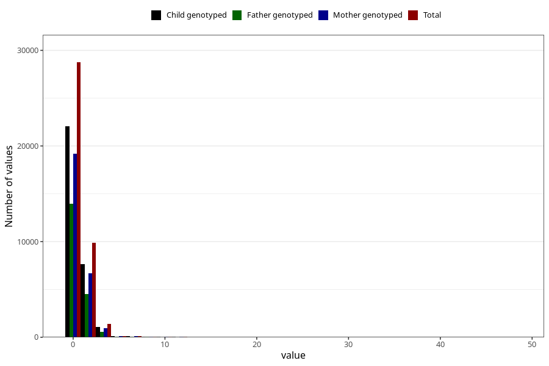

# soda_during
Variable mapping to questionnaire: q1m, question AA1396.
- Number of values:

| Value | Total | Child genotyped | Mother genotyped | Father genotyped |
| ----- | ----- | --------------- | ---------------- | ---------------- |
| Missing | 73074 | 52221 | 44683 | 30922 |
| Non-missing | 40549 | 31134 | 27086 | 19296 |
| Consumption have been reported by a mark but no amount given | 5 | 3 | 1 |0 |
| 25th percentile | 0 | 0 | 0 | 0 |
| 50th percentile | 0 | 0 | 0 | 0 |
| 75th percentile | 1 | 1 | 1 | 1 |

