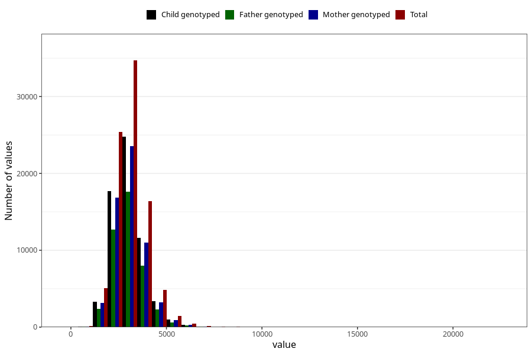

# sodium
Variable mapping to questionnaire: q2_cwd_calculations, question NATRIUM.
- Number of values:

| Value | Total | Child genotyped | Mother genotyped | Father genotyped |
| ----- | ----- | --------------- | ---------------- | ---------------- |
| Missing | 24927 | 14790 | 12674 | 6238 |
| Non-missing | 88696 | 68565 | 59095 | 43980 |
| 25th percentile | 2510.61 | 2516.28 | 2524.165 | 2517.265 |
| 50th percentile | 2971.43 | 2972.5 | 2977.15 | 2963.34 |
| 75th percentile | 3502.5225 | 3500.95 | 3499.51 | 3477.05 |

