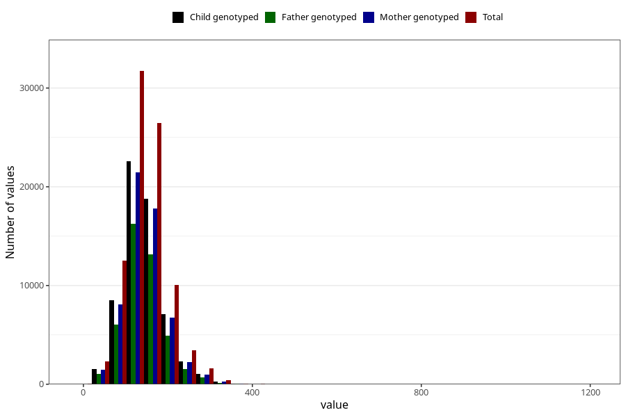

# starch
Variable mapping to questionnaire: q2_cwd_calculations, question STIVELSE.
- Number of values:

| Value | Total | Child genotyped | Mother genotyped | Father genotyped |
| ----- | ----- | --------------- | ---------------- | ---------------- |
| Missing | 24927 | 14790 | 12674 | 6238 |
| Non-missing | 88696 | 68565 | 59095 | 43980 |
| 25th percentile | 114.17 | 114.5 | 114.84 | 114.54 |
| 50th percentile | 140.93 | 140.97 | 141.02 | 140.235 |
| 75th percentile | 170.92 | 170.75 | 170.63 | 169.4925 |

