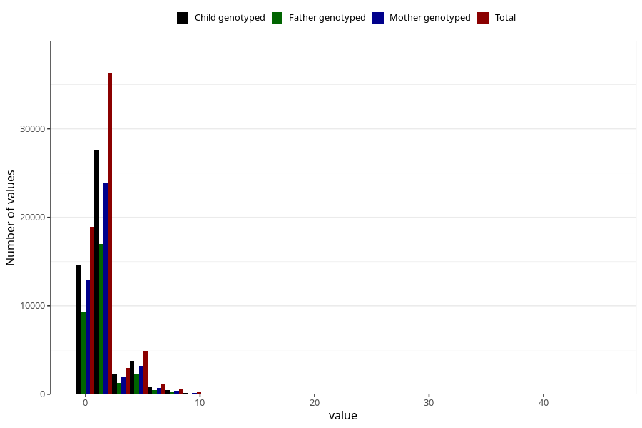

# tea_before
Variable mapping to questionnaire: q1m, question AA1386.
- Number of values:

| Value | Total | Child genotyped | Mother genotyped | Father genotyped |
| ----- | ----- | --------------- | ---------------- | ---------------- |
| Missing | 48365 | 33500 | 28671 | 19549 |
| Non-missing | 65258 | 49855 | 43098 | 30669 |
| Consumption have been reported by a mark but no amount given | 12 | 6 | 4 |4 |
| 25th percentile | 0 | 0 | 0 | 0 |
| 50th percentile | 1 | 1 | 1 | 1 |
| 75th percentile | 2 | 2 | 2 | 2 |

