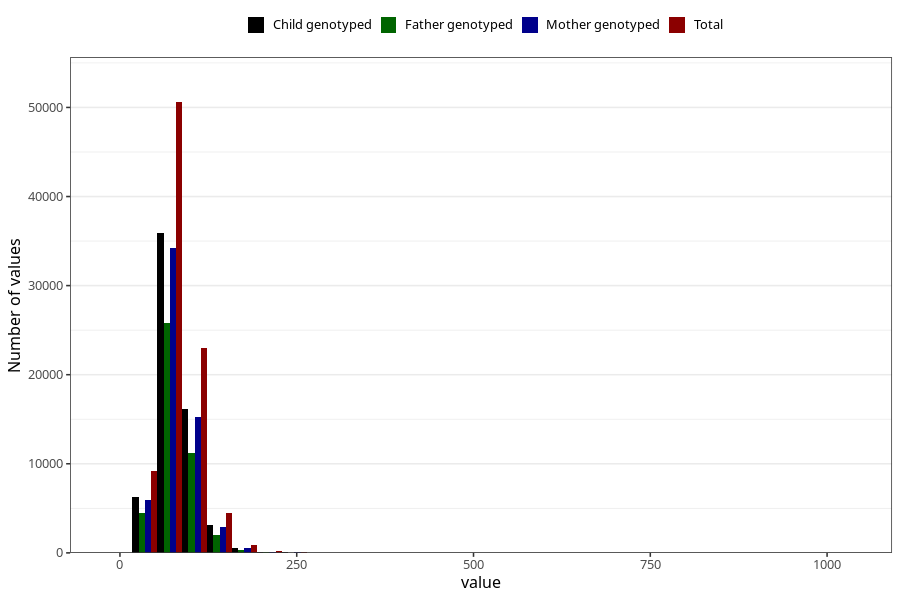

# tot_fat
Variable mapping to questionnaire: q2_cwd_calculations, question TOT_FETT.
- Number of values:

| Value | Total | Child genotyped | Mother genotyped | Father genotyped |
| ----- | ----- | --------------- | ---------------- | ---------------- |
| Missing | 24927 | 14790 | 12674 | 6238 |
| Non-missing | 88696 | 68565 | 59095 | 43980 |
| 25th percentile | 63.05 | 63.03 | 63.11 | 62.74 |
| 50th percentile | 76.915 | 76.85 | 76.81 | 76.22 |
| 75th percentile | 94.25 | 93.96 | 93.77 | 92.95 |

