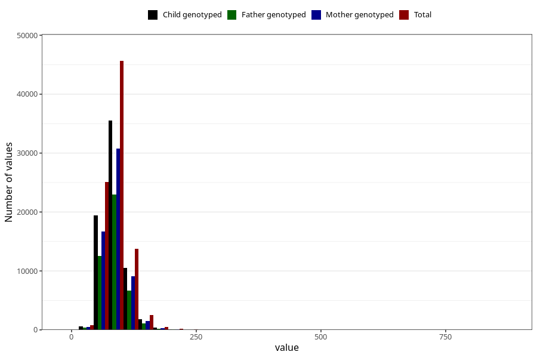

# tot_prot
Variable mapping to questionnaire: q2_cwd_calculations, question TOT_PROT.
- Number of values:

| Value | Total | Child genotyped | Mother genotyped | Father genotyped |
| ----- | ----- | --------------- | ---------------- | ---------------- |
| Missing | 24927 | 13198 | 12674 | 6238 |
| Non-missing | 88696 | 62233 | 59095 | 43980 |
| 25th percentile | 72.16 | 72.25 | 72.23 | 72.2 |
| 50th percentile | 84.69 | 84.62 | 84.59 | 84.41 |
| 75th percentile | 99.42 | 99.12 | 99.09 | 98.73 |

