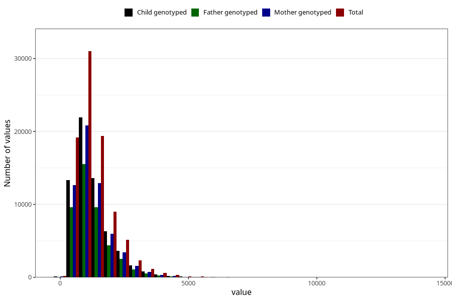

# total_retinol
Variable mapping to questionnaire: q2_cwd_calculations, question RET_EKVIV.
- Number of values:

| Value | Total | Child genotyped | Mother genotyped | Father genotyped |
| ----- | ----- | --------------- | ---------------- | ---------------- |
| Missing | 24927 | 14790 | 12674 | 6238 |
| Non-missing | 88696 | 68565 | 59095 | 43980 |
| 25th percentile | 770.56 | 769.87 | 772.635 | 767.785 |
| 50th percentile | 1109.815 | 1107.13 | 1109.27 | 1102.21 |
| 75th percentile | 1596.485 | 1594.6 | 1595.76 | 1581.6725 |

