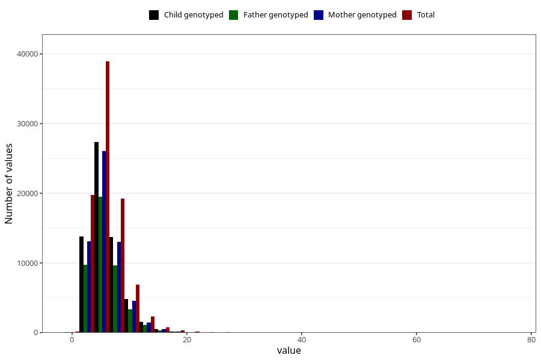

# vitamin_b12
Variable mapping to questionnaire: q2_cwd_calculations, question VIT_B12.
- Number of values:

| Value | Total | Child genotyped | Mother genotyped | Father genotyped |
| ----- | ----- | --------------- | ---------------- | ---------------- |
| Missing | 24927 | 14790 | 12674 | 6238 |
| Non-missing | 88696 | 68565 | 59095 | 43980 |
| 25th percentile | 4.06 | 4.05 | 4.06 | 4.06 |
| 50th percentile | 5.43 | 5.42 | 5.43 | 5.41 |
| 75th percentile | 7.3 | 7.29 | 7.28 | 7.25 |

