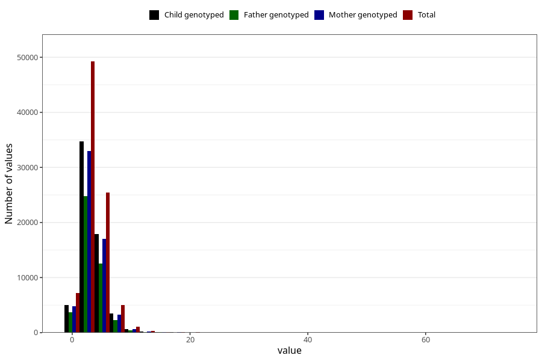

# vitamin_d
Variable mapping to questionnaire: q2_cwd_calculations, question VIT_D.
- Number of values:

| Value | Total | Child genotyped | Mother genotyped | Father genotyped |
| ----- | ----- | --------------- | ---------------- | ---------------- |
| Missing | 24927 | 13198 | 12674 | 6238 |
| Non-missing | 88696 | 62233 | 59095 | 43980 |
| 25th percentile | 2.14 | 2.13 | 2.13 | 2.11 |
| 50th percentile | 3.2 | 3.19 | 3.19 | 3.15 |
| 75th percentile | 4.46 | 4.44 | 4.43 | 4.4 |

