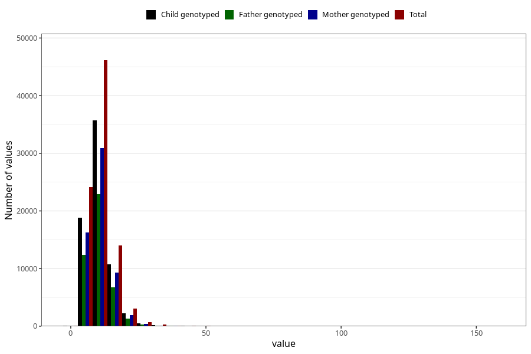

# vitamin_ed
Variable mapping to questionnaire: q2_cwd_calculations, question VIT_E.
- Number of values:

| Value | Total | Child genotyped | Mother genotyped | Father genotyped |
| ----- | ----- | --------------- | ---------------- | ---------------- |
| Missing | 24927 | 13198 | 12674 | 6238 |
| Non-missing | 88696 | 62233 | 59095 | 43980 |
| 25th percentile | 7.97 | 7.94 | 7.94 | 7.89 |
| 50th percentile | 10.04 | 9.98 | 9.98 | 9.92 |
| 75th percentile | 12.87 | 12.76 | 12.75 | 12.68 |

