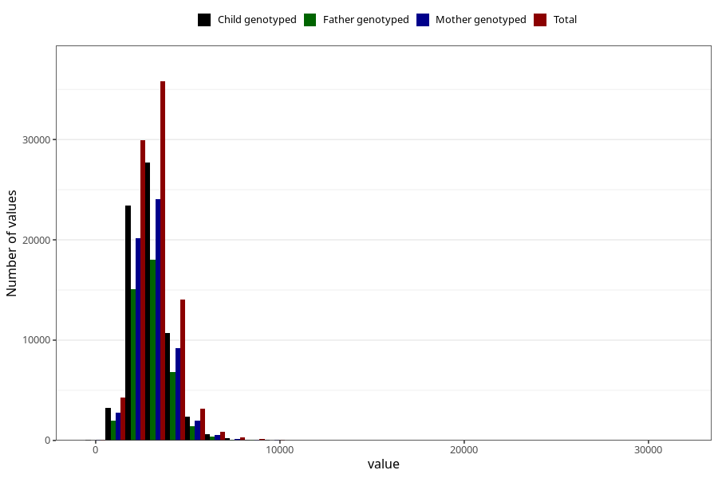

# water_g
Variable mapping to questionnaire: q2_cwd_calculations, question VANN_G.
- Number of values:

| Value | Total | Child genotyped | Mother genotyped | Father genotyped |
| ----- | ----- | --------------- | ---------------- | ---------------- |
| Missing | 24927 | 14790 | 12674 | 6238 |
| Non-missing | 88696 | 68565 | 59095 | 43980 |
| 25th percentile | 2356.1075 | 2350.32 | 2353.855 | 2354.0875 |
| 50th percentile | 2964.84 | 2959.7 | 2959.55 | 2956.935 |
| 75th percentile | 3633.415 | 3622.57 | 3616.135 | 3606.45 |

