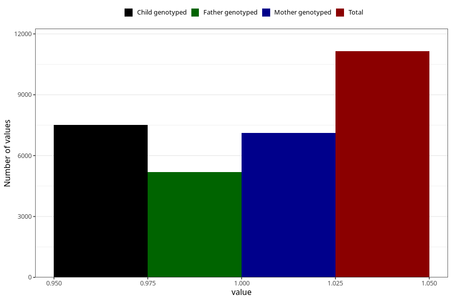

# abdominal_pain_9w_12w
Variable mapping to questionnaire: q1m, question AA188.
- Number of values:

| Value | Total | Child genotyped | Mother genotyped | Father genotyped |
| ----- | ----- | --------------- | ---------------- | ---------------- |
| Missing | 102479 | 67923 | 64652 | 45040 |
| Non-missing | 11144 | 7508 | 7117 | 5178 |
| 1 | 11144 | 7508 | 7117 | 5178 |

