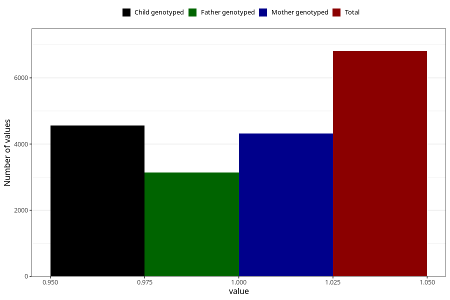

# abdominal_pain_before_4w
Variable mapping to questionnaire: q1m, question AA186.
- Number of values:

| Value | Total | Child genotyped | Mother genotyped | Father genotyped |
| ----- | ----- | --------------- | ---------------- | ---------------- |
| Missing | 106814 | 78260 | 67448 | 47071 |
| Non-missing | 6809 | 5095 | 4321 | 3147 |
| 1 | 6809 | 5095 | 4321 | 3147 |

