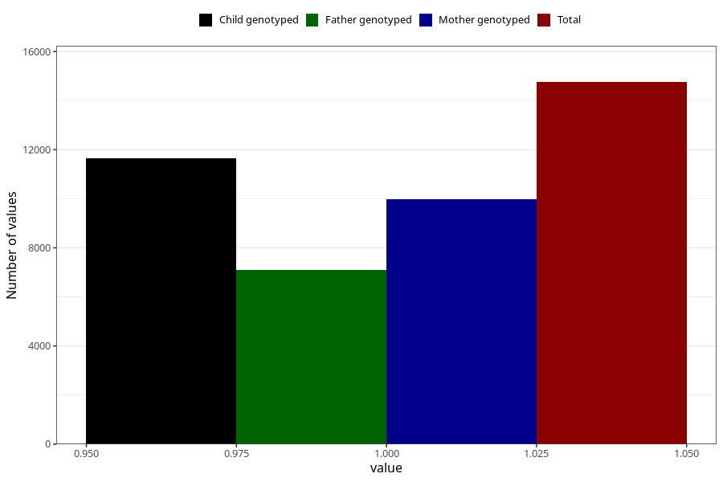

# back_pain_17w_20w
Variable mapping to questionnaire: q3, question CC353.
- Number of values:

| Value | Total | Child genotyped | Mother genotyped | Father genotyped |
| ----- | ----- | --------------- | ---------------- | ---------------- |
| Missing | 98869 | 71719 | 61791 | 43127 |
| Non-missing | 14754 | 11636 | 9978 | 7091 |
| 1 | 14754 | 11636 | 9978 | 7091 |

