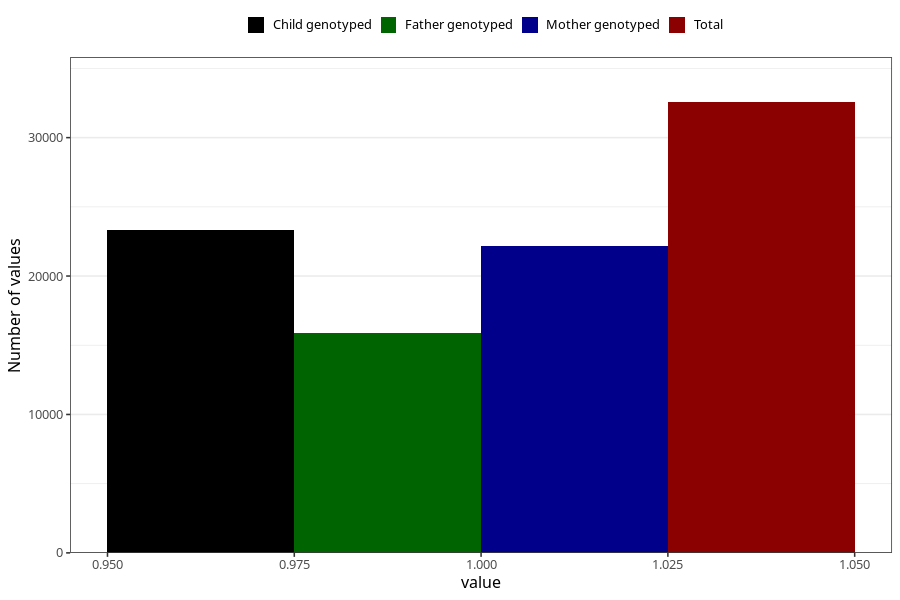

# back_pain_25w_28w
Variable mapping to questionnaire: q3, question CC355.
- Number of values:

| Value | Total | Child genotyped | Mother genotyped | Father genotyped |
| ----- | ----- | --------------- | ---------------- | ---------------- |
| Missing | 81062 | 57646 | 49587 | 34336 |
| Non-missing | 32561 | 25709 | 22182 | 15882 |
| 1 | 32561 | 25709 | 22182 | 15882 |

