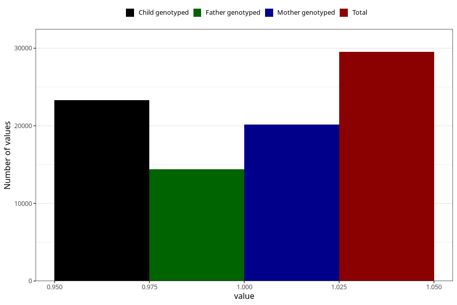

# back_pain_after_29w
Variable mapping to questionnaire: q3, question CC356.
- Number of values:

| Value | Total | Child genotyped | Mother genotyped | Father genotyped |
| ----- | ----- | --------------- | ---------------- | ---------------- |
| Missing | 84111 | 60031 | 51587 | 35794 |
| Non-missing | 29512 | 23324 | 20182 | 14424 |
| 1 | 29512 | 23324 | 20182 | 14424 |

