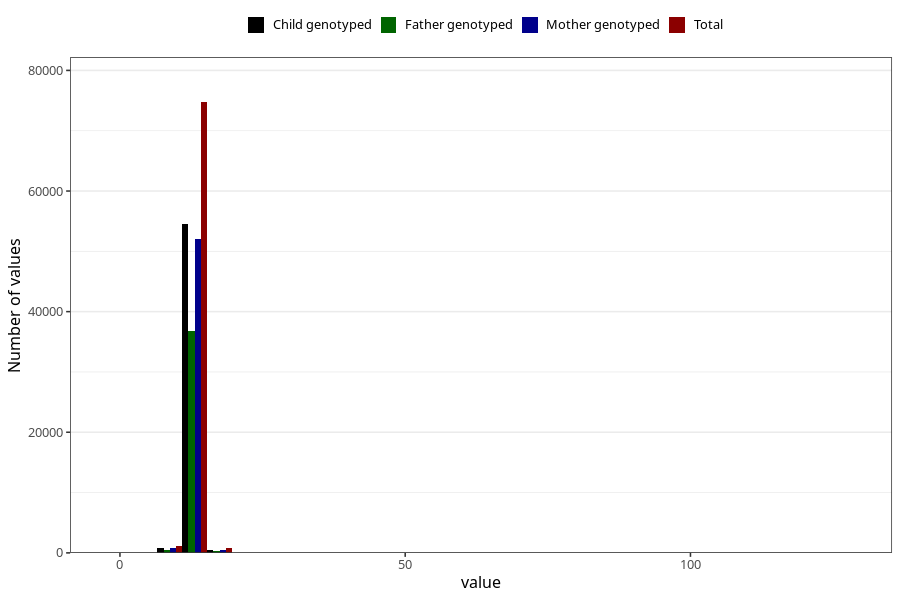

# blood_haemoglobin_highest_30w
Variable mapping to questionnaire: q3, question CC126.
- Number of values:

| Value | Total | Child genotyped | Mother genotyped | Father genotyped |
| ----- | ----- | --------------- | ---------------- | ---------------- |
| Missing | 36784 | 19503 | 18410 | 12458 |
| Non-missing | 76839 | 55928 | 53359 | 37760 |
| 25th percentile | 12.3 | 12.3 | 12.3 | 12.3 |
| 50th percentile | 12.9 | 12.9 | 12.9 | 12.9 |
| 75th percentile | 13.5 | 13.5 | 13.5 | 13.6 |

