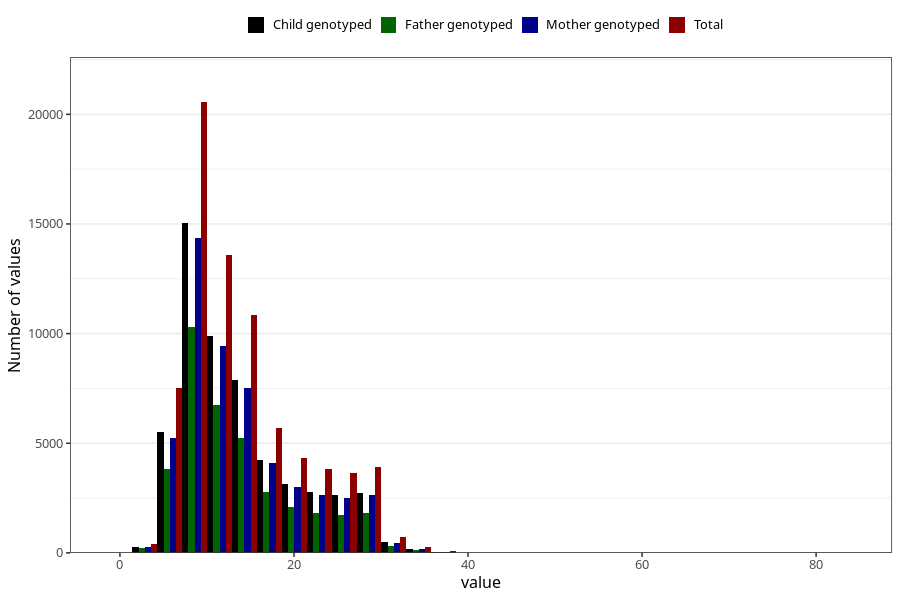

# blood_haemoglobin_highest_week_30w
Variable mapping to questionnaire: q3, question CC127.
- Number of values:

| Value | Total | Child genotyped | Mother genotyped | Father genotyped |
| ----- | ----- | --------------- | ---------------- | ---------------- |
| Missing | 38264 | 23171 | 19354 | 13108 |
| Non-missing | 75359 | 60184 | 52415 | 37110 |
| 25th percentile | 9 | 9 | 9 | 9 |
| 50th percentile | 12 | 12 | 12 | 12 |
| 75th percentile | 17 | 17 | 17 | 17 |

