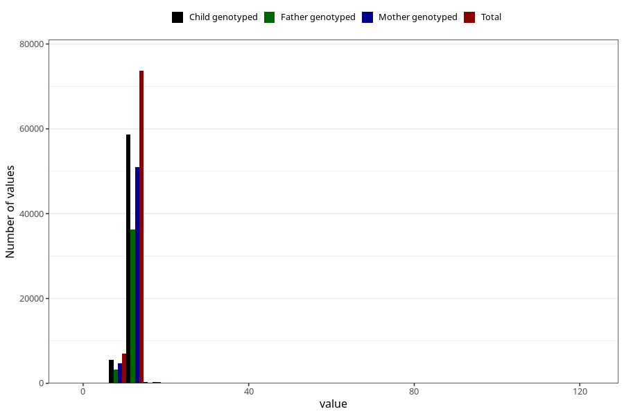

# blood_haemoglobin_last_check_30w
Variable mapping to questionnaire: q3, question CC124.
- Number of values:

| Value | Total | Child genotyped | Mother genotyped | Father genotyped |
| ----- | ----- | --------------- | ---------------- | ---------------- |
| Missing | 32398 | 16625 | 15706 | 10481 |
| Non-missing | 81225 | 58806 | 56063 | 39737 |
| 25th percentile | 11.2 | 11.2 | 11.2 | 11.2 |
| 50th percentile | 11.8 | 11.8 | 11.8 | 11.9 |
| 75th percentile | 12.5 | 12.5 | 12.5 | 12.5 |

