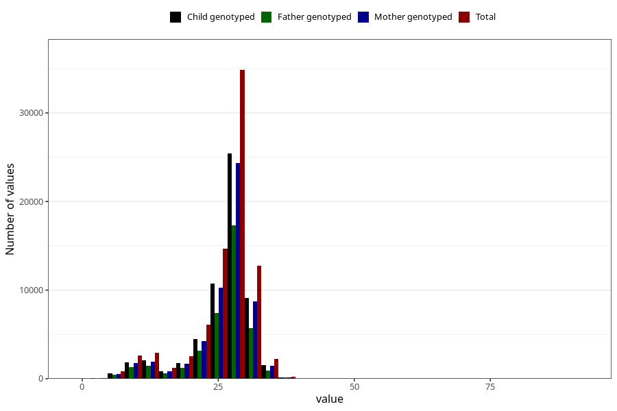

# blood_haemoglobin_last_check_week_30w
Variable mapping to questionnaire: q3, question CC125.
- Number of values:

| Value | Total | Child genotyped | Mother genotyped | Father genotyped |
| ----- | ----- | --------------- | ---------------- | ---------------- |
| Missing | 32537 | 16663 | 15746 | 10483 |
| Non-missing | 81086 | 58768 | 56023 | 39735 |
| 25th percentile | 24 | 25 | 25 | 24 |
| 50th percentile | 28 | 28 | 28 | 27 |
| 75th percentile | 29 | 29 | 29 | 29 |

