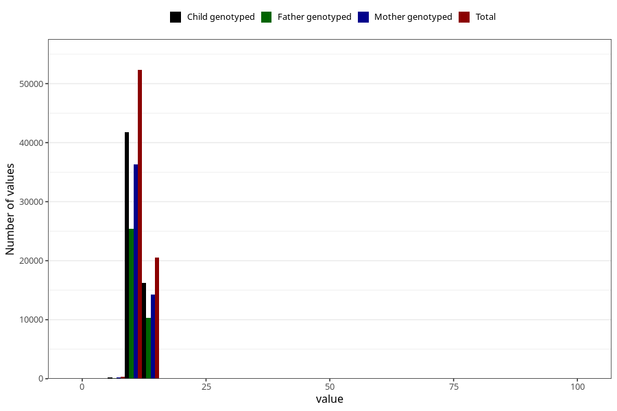

# blood_haemoglobin_lowest_30w
Variable mapping to questionnaire: q3, question CC128.
- Number of values:

| Value | Total | Child genotyped | Mother genotyped | Father genotyped |
| ----- | ----- | --------------- | ---------------- | ---------------- |
| Missing | 40333 | 24894 | 20868 | 14283 |
| Non-missing | 73290 | 58461 | 50901 | 35935 |
| 25th percentile | 10.8 | 10.8 | 10.9 | 10.9 |
| 50th percentile | 11.5 | 11.5 | 11.5 | 11.5 |
| 75th percentile | 12.1 | 12.1 | 12.1 | 12.2 |

