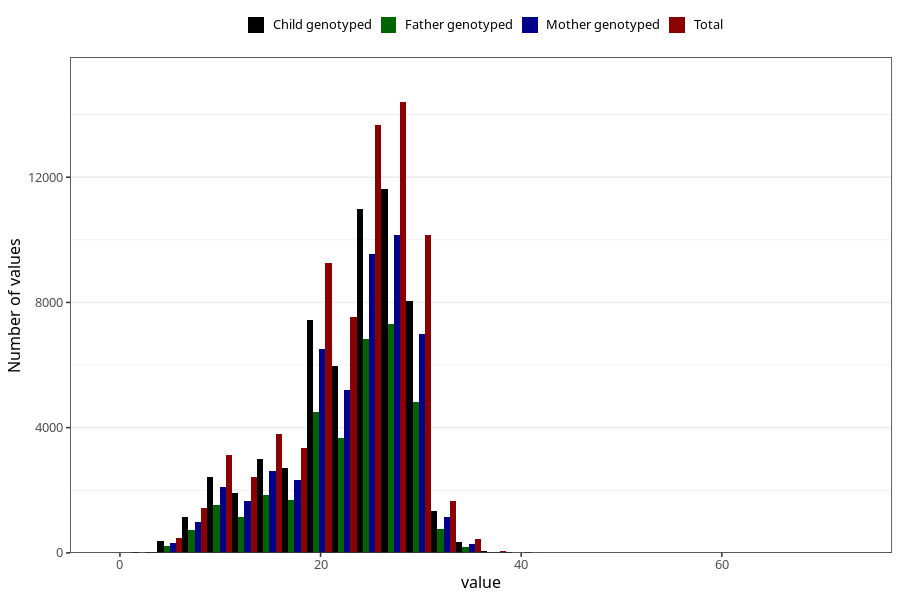

# blood_haemoglobin_lowest_week_30w
Variable mapping to questionnaire: q3, question CC129.
- Number of values:

| Value | Total | Child genotyped | Mother genotyped | Father genotyped |
| ----- | ----- | --------------- | ---------------- | ---------------- |
| Missing | 41781 | 26003 | 21809 | 14946 |
| Non-missing | 71842 | 57352 | 49960 | 35272 |
| 25th percentile | 20 | 20 | 20 | 20 |
| 50th percentile | 24 | 24 | 24 | 24 |
| 75th percentile | 28 | 28 | 28 | 28 |

