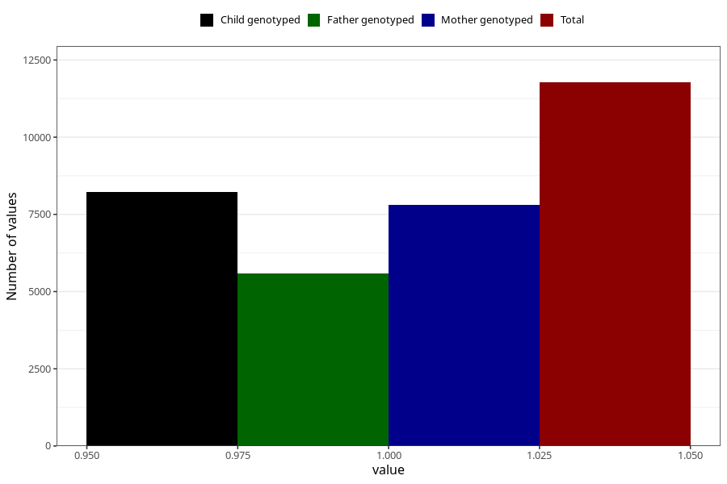

# common_cold_9w_12w
Variable mapping to questionnaire: q1m, question AA348.
- Number of values:

| Value | Total | Child genotyped | Mother genotyped | Father genotyped |
| ----- | ----- | --------------- | ---------------- | ---------------- |
| Missing | 101850 | 67205 | 63955 | 44630 |
| Non-missing | 11773 | 8226 | 7814 | 5588 |
| 1 | 11773 | 8226 | 7814 | 5588 |

