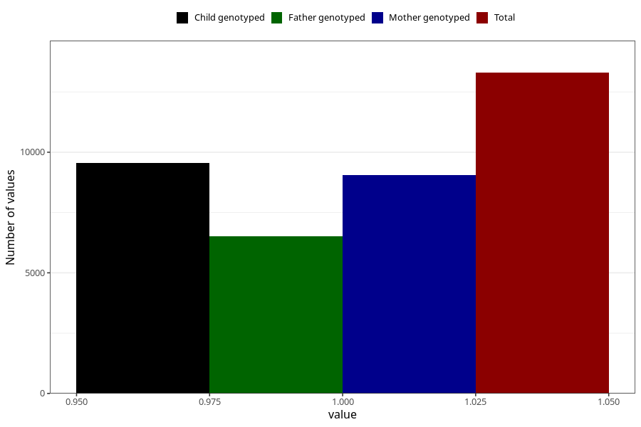

# constipation_13w_16w
Variable mapping to questionnaire: q3, question CC436.
- Number of values:

| Value | Total | Child genotyped | Mother genotyped | Father genotyped |
| ----- | ----- | --------------- | ---------------- | ---------------- |
| Missing | 100328 | 72855 | 62710 | 43703 |
| Non-missing | 13295 | 10500 | 9059 | 6515 |
| 1 | 13295 | 10500 | 9059 | 6515 |

