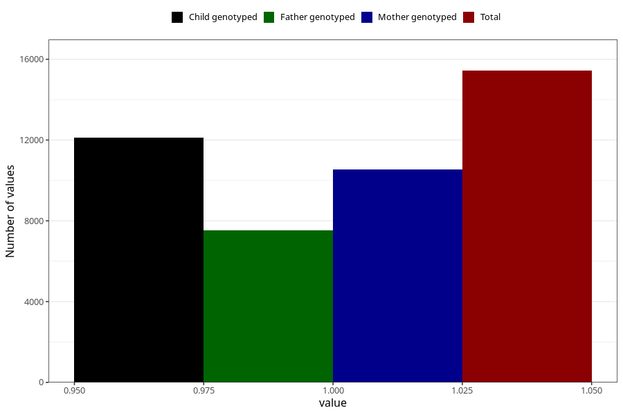

# constipation_17w_20w
Variable mapping to questionnaire: q3, question CC437.
- Number of values:

| Value | Total | Child genotyped | Mother genotyped | Father genotyped |
| ----- | ----- | --------------- | ---------------- | ---------------- |
| Missing | 98188 | 64351 | 61225 | 42682 |
| Non-missing | 15435 | 11080 | 10544 | 7536 |
| 1 | 15435 | 11080 | 10544 | 7536 |

