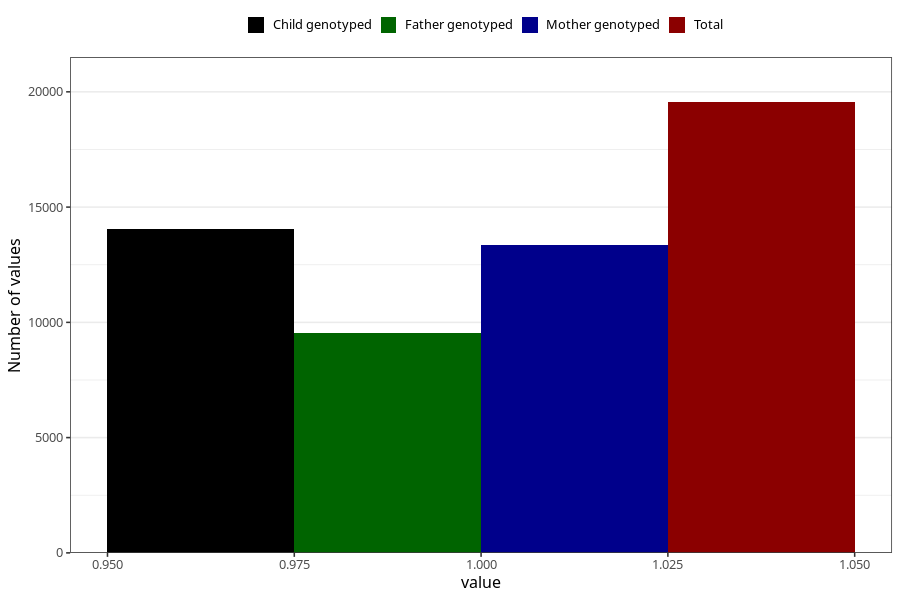

# constipation_25w_28w
Variable mapping to questionnaire: q3, question CC439.
- Number of values:

| Value | Total | Child genotyped | Mother genotyped | Father genotyped |
| ----- | ----- | --------------- | ---------------- | ---------------- |
| Missing | 94073 | 67988 | 58401 | 40698 |
| Non-missing | 19550 | 15367 | 13368 | 9520 |
| 1 | 19550 | 15367 | 13368 | 9520 |

