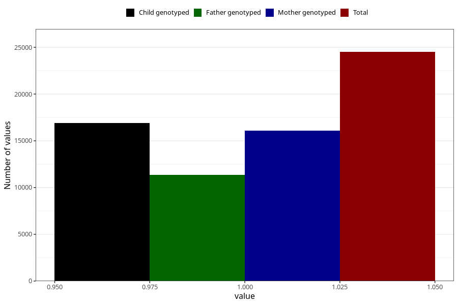

# constipation_9w_12w
Variable mapping to questionnaire: q1m, question AA268.
- Number of values:

| Value | Total | Child genotyped | Mother genotyped | Father genotyped |
| ----- | ----- | --------------- | ---------------- | ---------------- |
| Missing | 89121 | 58505 | 55696 | 38846 |
| Non-missing | 24502 | 16926 | 16073 | 11372 |
| 1 | 24502 | 16926 | 16073 | 11372 |

