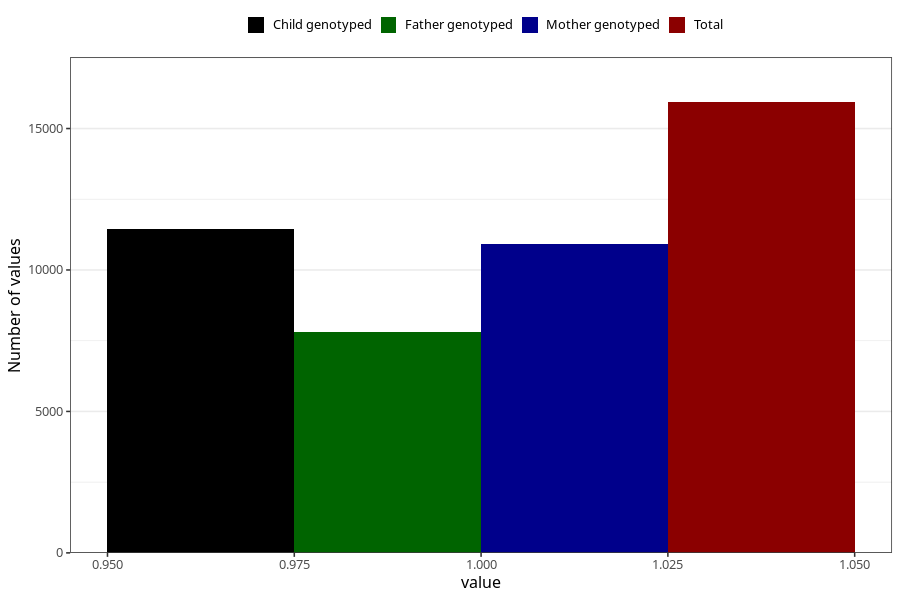

# constipation_after_29w
Variable mapping to questionnaire: q3, question CC440.
- Number of values:

| Value | Total | Child genotyped | Mother genotyped | Father genotyped |
| ----- | ----- | --------------- | ---------------- | ---------------- |
| Missing | 97692 | 70847 | 60862 | 42427 |
| Non-missing | 15931 | 12508 | 10907 | 7791 |
| 1 | 15931 | 12508 | 10907 | 7791 |

