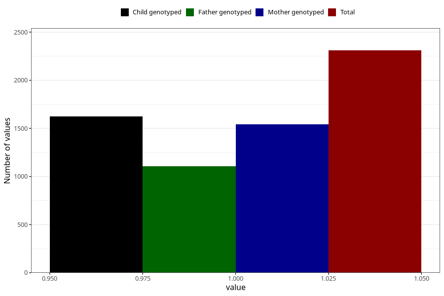

# diarrhoea_17w_20w
Variable mapping to questionnaire: q3, question CC449.
- Number of values:

| Value | Total | Child genotyped | Mother genotyped | Father genotyped |
| ----- | ----- | --------------- | ---------------- | ---------------- |
| Missing | 111313 | 81570 | 70229 | 49113 |
| Non-missing | 2310 | 1785 | 1540 | 1105 |
| 1 | 2310 | 1785 | 1540 | 1105 |

