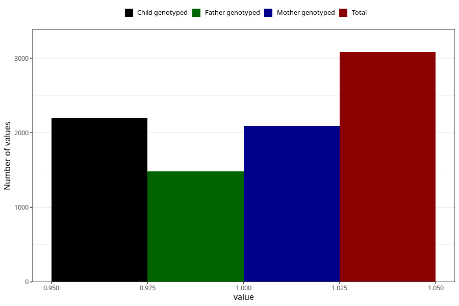

# diarrhoea_21w_24w
Variable mapping to questionnaire: q3, question CC450.
- Number of values:

| Value | Total | Child genotyped | Mother genotyped | Father genotyped |
| ----- | ----- | --------------- | ---------------- | ---------------- |
| Missing | 110542 | 80947 | 69677 | 48736 |
| Non-missing | 3081 | 2408 | 2092 | 1482 |
| 1 | 3081 | 2408 | 2092 | 1482 |

