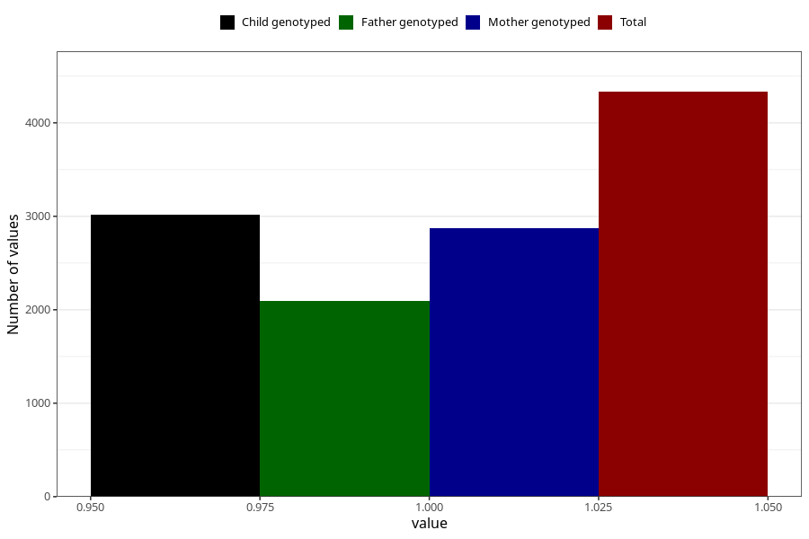

# diarrhoea_9w_12w
Variable mapping to questionnaire: q1m, question AA278.
- Number of values:

| Value | Total | Child genotyped | Mother genotyped | Father genotyped |
| ----- | ----- | --------------- | ---------------- | ---------------- |
| Missing | 109291 | 80035 | 68900 | 48125 |
| Non-missing | 4332 | 3320 | 2869 | 2093 |
| 1 | 4332 | 3320 | 2869 | 2093 |

