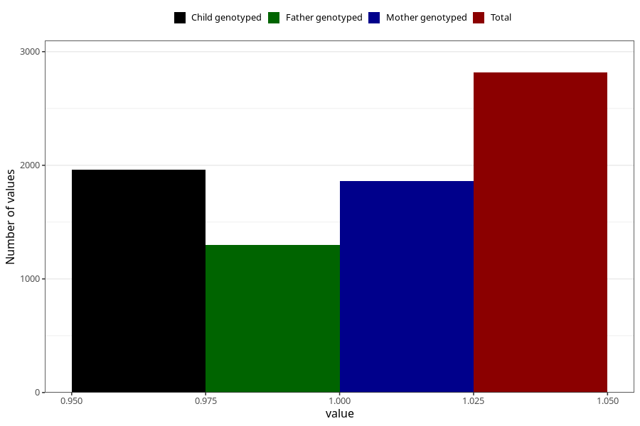

# diarrhoea_after_29w
Variable mapping to questionnaire: q3, question CC452.
- Number of values:

| Value | Total | Child genotyped | Mother genotyped | Father genotyped |
| ----- | ----- | --------------- | ---------------- | ---------------- |
| Missing | 110807 | 81187 | 69906 | 48917 |
| Non-missing | 2816 | 2168 | 1863 | 1301 |
| 1 | 2816 | 2168 | 1863 | 1301 |

