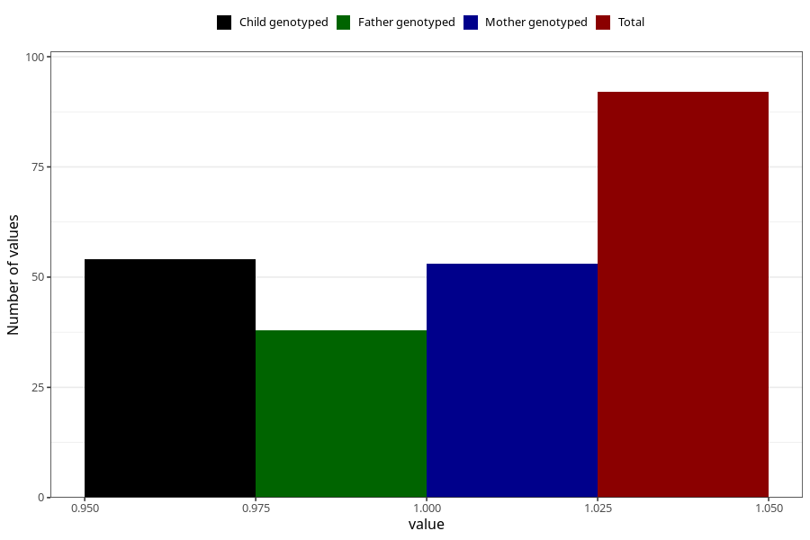

# fever_with_rash_9w_12w
Variable mapping to questionnaire: q1m, question AA328.
- Number of values:

| Value | Total | Child genotyped | Mother genotyped | Father genotyped |
| ----- | ----- | --------------- | ---------------- | ---------------- |
| Missing | 113531 | 83287 | 71716 | 50180 |
| Non-missing | 92 | 68 | 53 | 38 |
| 1 | 92 | 68 | 53 | 38 |

