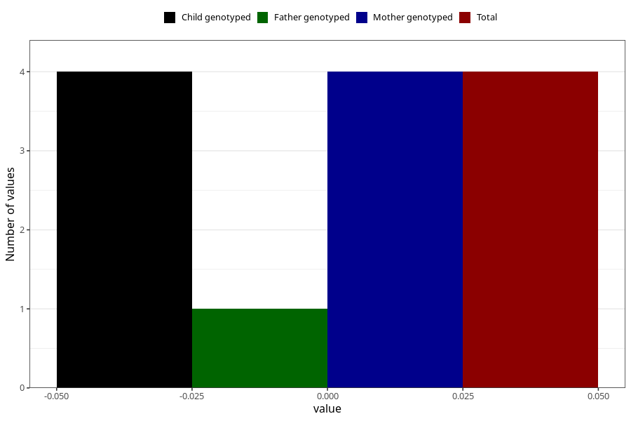

# high_blood_pressure_during_pregnancy_30w_2
Variable mapping to questionnaire: q3, question CC1434.
- Number of values:

| Value | Total | Child genotyped | Mother genotyped | Father genotyped |
| ----- | ----- | --------------- | ---------------- | ---------------- |
| Missing | 109164 | 79608 | 68406 | 49101 |
| Non-missing | 4459 | 3747 | 3363 | 1117 |
| Do not know | 61 | 50 | 45 |10 |
| No | 4194 | 3537 | 3169 |1061 |
| Yes | 200 | 156 | 145 |45 |
| 0 | 4 | 4 | 4 | 1 |

