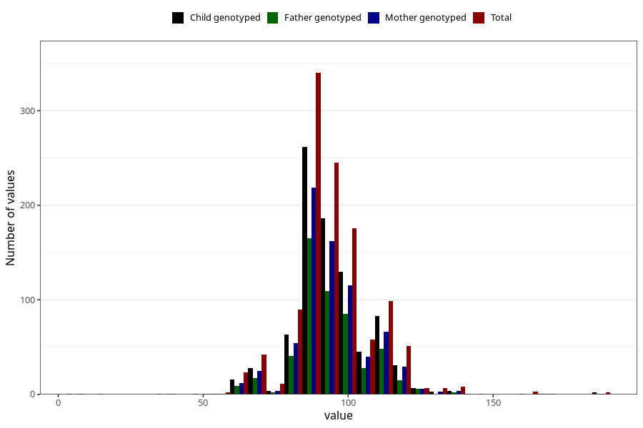

# highest_blood_pressure_before_pregnancy_diastolic
Variable mapping to questionnaire: q3, question CC119.
- Number of values:

| Value | Total | Child genotyped | Mother genotyped | Father genotyped |
| ----- | ----- | --------------- | ---------------- | ---------------- |
| Missing | 112453 | 82484 | 71024 | 49688 |
| Non-missing | 1170 | 871 | 745 | 530 |
| 25th percentile | 90 | 90 | 90 | 90 |
| 50th percentile | 95 | 95 | 95 | 95 |
| 75th percentile | 100 | 100 | 100 | 100 |

