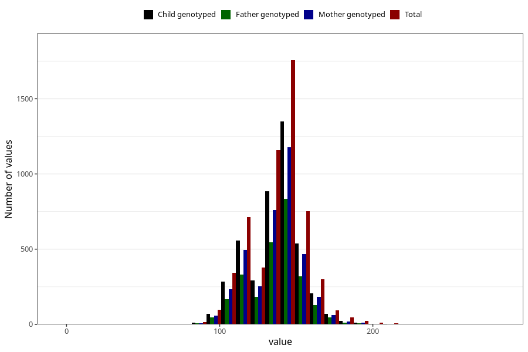

# highest_blood_pressure_during_pregnancy_30w_systolic
Variable mapping to questionnaire: q3, question CC114.
- Number of values:

| Value | Total | Child genotyped | Mother genotyped | Father genotyped |
| ----- | ----- | --------------- | ---------------- | ---------------- |
| Missing | 107928 | 79054 | 68036 | 47589 |
| Non-missing | 5695 | 4301 | 3733 | 2629 |
| 25th percentile | 125 | 125 | 125 | 125 |
| 50th percentile | 140 | 140 | 140 | 140 |
| 75th percentile | 145 | 145 | 145 | 145 |

