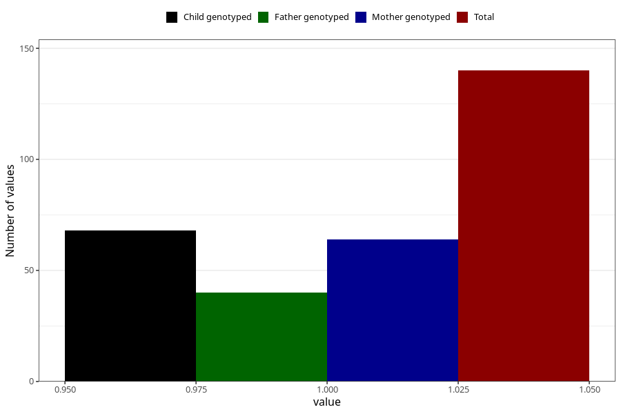

# hospitalized_amniotic_fluid_leakage
Variable mapping to questionnaire: q3, question CC155.
- Number of values:

| Value | Total | Child genotyped | Mother genotyped | Father genotyped |
| ----- | ----- | --------------- | ---------------- | ---------------- |
| Missing | 113483 | 83278 | 71705 | 50178 |
| Non-missing | 140 | 77 | 64 | 40 |
| 1 | 140 | 77 | 64 | 40 |

